  <picture>
    <source media="(prefers-color-scheme: dark)" srcset="assets/hero-dark.svg" />
    
  </picture>

  
  
  

  AI engineer who builds generative systems that stay dependable when the models beneath them don't. Built TestRAGic, a retrieval-based tool that turns unstructured video transcripts into structured QA test cases, with a fallback chain across multiple LLM providers to keep output quality stable, and shipped four multi-modal applications on Google's Vertex AI and Gemini. Author of a peer-reviewed CNN study (CRC Press, 2026) that raised validation accuracy from 56% to 90% by diagnosing class imbalance and overfitting rather than simply scaling the model.

<h3 align="center"><picture>
  <source media="(prefers-color-scheme: dark)" srcset="assets/heading-projects-dark.svg" />
  
</picture></h3>

  <a href="https://github.com/jiten0709/TestRAGic"><picture>
    <source media="(prefers-color-scheme: dark)" srcset="assets/card-testragic-dark.svg" />
    
  </picture></a>
  <a href="https://github.com/jiten0709/SurakshaSetu"><picture>
    <source media="(prefers-color-scheme: dark)" srcset="assets/card-surakshasetu-dark.svg" />
    
  </picture></a>

<h3 align="center"><picture>
  <source media="(prefers-color-scheme: dark)" srcset="assets/heading-research-dark.svg" />
  
</picture></h3>

  <a href="https://doi.org/10.1201/9781003731689-111"><picture>
    <source media="(prefers-color-scheme: dark)" srcset="assets/card-paper-dark.svg" />
    
  </picture></a>

<h3 align="center"><picture>
  <source media="(prefers-color-scheme: dark)" srcset="assets/heading-stack-dark.svg" />
  
</picture></h3>

  <picture>
    <source media="(prefers-color-scheme: dark)" srcset="assets/tech-dark.svg" />
    
  </picture>

Plain-text list

| **Category**                   | **Technologies & Frameworks**                                                                       |
| :----------------------------- | :-------------------------------------------------------------------------------------------------- |
| **Languages**                  | `Python`, `JavaScript`, `TypeScript`, `SQL`                                                         |
| **Generative AI & Agents**     | `LangChain`, `LangGraph`, `LlamaIndex`, `MCP`, `RAG`, `AI Agents`, `Prompt Engineering`             |
| **LLM Engineering**            | `Hugging Face`, `vLLM`, `Ollama`, `LoRA`, `PEFT`, `Fine-tuning`, `LLM APIs`                         |
| **Evaluation & Observability** | `RAGAS`, `TruLens`, `LangSmith`                                                                     |
| **Machine Learning & CV**      | `PyTorch`, `TensorFlow`, `Scikit-learn`, `CNN`, `NLP`, `OpenCV`, `YOLO`                             |
| **Vector Search & Data**       | `Qdrant`, `Pinecone`, `Weaviate`, `Milvus`, `FAISS`, `ChromaDB`, `LanceDB`, `PostgreSQL`, `MongoDB` |
| **Backend & APIs**             | `FastAPI`, `Flask`, `Django`, `Node.js`, `NestJS`, `RESTful APIs`                                   |
| **Frontend & AI Interfaces**   | `React.js`, `Next.js`, `Vue.js`, `Streamlit`, `Chainlit`                                            |
| **Cloud & MLOps**              | `GCP (Vertex AI, AutoML)`, `AWS`, `Azure`, `MLflow`, `Docker`, `Kubernetes`, `CI/CD`, `Git`         |
| **Workflow Automation**        | `n8n`, `Make`, `Zapier`                                                                             |

<h3 align="center"><picture>
  <source media="(prefers-color-scheme: dark)" srcset="assets/heading-activity-dark.svg" />
  
</picture></h3>

  <!-- <picture>
    <source media="(prefers-color-scheme: dark)" srcset="https://github-readme-stats.vercel.app/api?username=jiten0709&show_icons=true&hide_rank=true&disable_animations=true&bg_color=151D2A&title_color=6366F1&icon_color=22D3EE&text_color=94A3B8&border_color=1E293B&border_radius=16" />
    
  </picture> -->
  <picture>
    <source media="(prefers-color-scheme: dark)" srcset="https://github-readme-stats.vercel.app/api/top-langs/?username=jiten0709&layout=compact&disable_animations=true&bg_color=151D2A&title_color=6366F1&text_color=94A3B8&border_color=1E293B&border_radius=16" />
    
  </picture>

  Open to AI Engineer roles, full-time or freelance · <a href="mailto:parmar.jiten03@gmail.com">Let's build something →</a>

